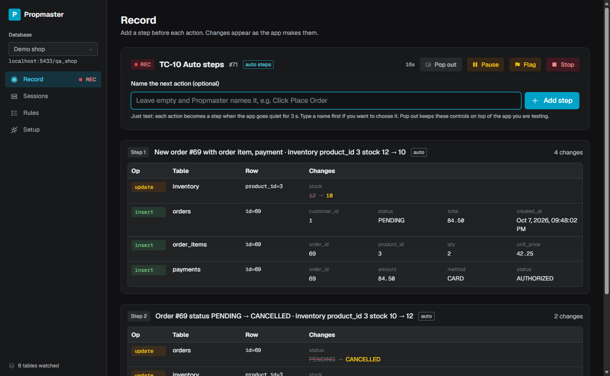
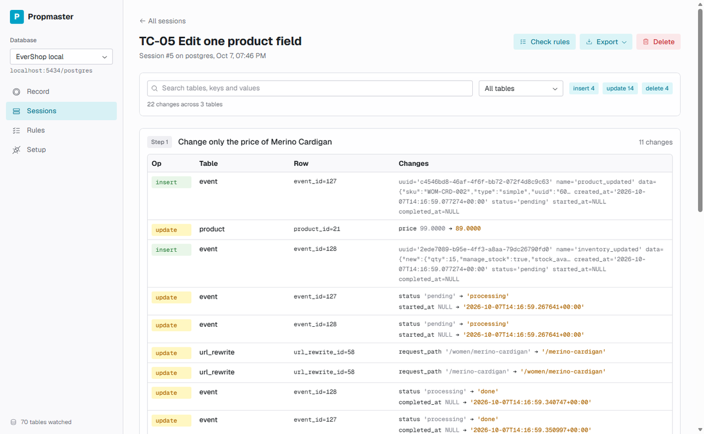
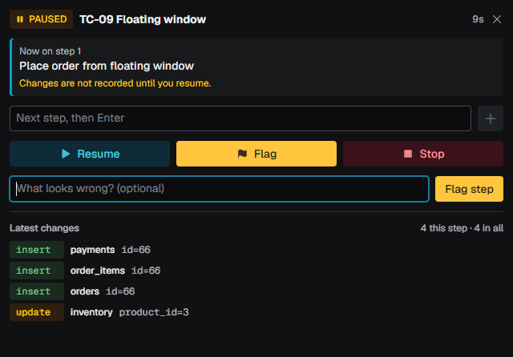

# Propmaster

**See exactly what the database did while you tested.**

Propmaster is a test-data toolkit for QA engineers, built on PostgreSQL. Tool 1, the **DB Change Recorder**, records every insert, update and delete your test causes, grouped by the test step that caused it. Then it checks the recording against your business rules, and turns it into a bug-ticket report or SQL checks you can re-run.

Tool 2, the **[Test Data Finder](#find-test-data-tool-2)**, finds the data a test needs ("a customer who has never ordered") with shared SQL recipes, and lets you claim a row so nobody else on the test database uses it while you test.

> "I clicked **Place Order** and the screen said 'Success'. But did it create the payment row? Did it reduce the stock? Did it change something else?"


```
$ propmaster record start "Checkout happy path"
 ● REC  Session #12 · Checkout happy path                       6 tables watched
   → before each test step: propmaster record step "<name>"
   → when you are done:    propmaster record stop
$ propmaster record step "Click Place Order"
   ...the tester clicks through the app...
$ propmaster record step "Cancel the order"
$ propmaster record stop
 ■ Stopped session #12

  PROPMASTER   Session #12 · Checkout happy path
 qa_shop · 2026-10-07 16:52:30 → 16:53:00 (30s) · UTC+05:30

 STEP 1  Click Place Order                                             4 changes
 ┌────────┬─────────────┬──────────────┬───────────────────────────────────────┐
 │ Op     │ Table       │ Row          │ Changes                               │
 ├────────┼─────────────┼──────────────┼───────────────────────────────────────┤
 │ update │ inventory   │ product_id=3 │ stock 20 → 18                         │
 │ insert │ orders      │ id=57        │ customer_id=1 status='PENDING'        │
 │        │             │              │ total=84.50                           │
 │        │             │              │ created_at='2026-10-07T11:22:44.0110… │
 │ insert │ order_items │ id=57        │ order_id=57 product_id=3 qty=2        │
 │        │             │              │ unit_price=42.25                      │
 │ insert │ payments    │ id=57        │ order_id=57 amount=84.50              │
 │        │             │              │ method='CARD' status='AUTHORIZED'     │
 └────────┴─────────────┴──────────────┴───────────────────────────────────────┘

 STEP 2  Cancel the order                                              2 changes
 ┌────────┬─────────────┬──────────────┬───────────────────────────────────────┐
 │ Op     │ Table       │ Row          │ Changes                               │
 ├────────┼─────────────┼──────────────┼───────────────────────────────────────┤
 │ update │ orders      │ id=57        │ status 'PENDING' → 'CANCELLED'        │
 │ update │ inventory   │ product_id=3 │ stock 18 → 20                         │
 └────────┴─────────────┴──────────────┴───────────────────────────────────────┘

 ──────────────────────────────────────────────────────────────────────────────
 6 changes · 4 tables · 3 inserts · 3 updates
```

## Why

- Bug reports say "it broke" without proof of what the data looked like.
- The UI can say "Success" while the database tells another story: a missing payment row, stock that didn't change, or an unrelated table that did.
- Audit tools serve compliance and diff tools serve data engineers. Nothing records database changes **per test step, for the tester**.

## Quick start

**Just want to see it?** With only Docker installed:

```sh
docker compose run --rm demo   # starts Postgres with the demo shop, then records, reports and checks rules
```

### The web app (recommended)

With Node 22.12+:

```sh
npm install
npm run build
npm run ui           # opens Propmaster in your browser
```

1. **Setup:** paste your test database's connection string, press **Test** to see what your DB user can do, and save it. Install the recorder with one click.
2. **Record:** name the test case and press **Start recording**. Before each action in the app you're testing, type what you're about to do and press Enter. The changes appear live under that step.
   - **Name steps for me** (live recording): no typing at all. Each action you take becomes a step when the app goes quiet for 3 seconds, named after what it changed, such as *New order #66 with order item, payment · inventory product_id 3 stock 14 → 12* or *Order #66 status PENDING → CANCELLED*. Type a name first when you want to choose it.
   - **Pop out** (Chrome and Edge) opens a small floating window that stays on top of the app you're testing: add steps, pause, flag and stop from there, and watch the latest changes arrive.
   - **Pause** while you do setup that isn't part of the test; nothing is recorded until you resume.
   - **Flag** a step when something looks wrong, with a note. Flags show in the timeline and in every export.
3. **Sessions:** the list is paged (20 a page); tick sessions to delete several at once, or use the bin on a row. Open any recording to rename a step (the pencil next to its name), search it, filter by table or operation, and export it (HTML, Markdown, SQL checks). Each change is laid out as labelled fields: the new values of an insert, *old → new* for an update, and what a deleted row held, with text unquoted and times in your local format. JSON keeps its structure: indented, and for an update the paths that changed (`[0].goodsWeight 1000 → 500`), with the full JSON before and after one click away. Click a change for every column, exactly as stored.
4. **Rules:** open your rules file, edit it, and run it against a session.







The web app runs on your own machine only: it listens on `127.0.0.1`, every request needs the secret token in the link it opens, and requests from other websites are refused. Saved connections live in `~/.propmaster/ui.json`.

### The command line

Everything the web app does is also a command, which suits CI and scripts:

```sh
npm install
npm run db:up        # PostgreSQL 17 with the qa_shop demo database, on port 5433
cp .env.example .env

npm run demo         # the whole flow in one command: record, timeline, HTML/Markdown/SQL exports
```

Or step by step, with the demo shop standing in for the app's buttons:

```sh
npm run propmaster -- install
npm run propmaster -- record start "My test"
npm run propmaster -- record step "Click Place Order"
npm run shop -- order 1 3 2
npm run propmaster -- record stop
npm run propmaster -- record export --open
```

Installed as a package, the command is `propmaster`, or `prop` for short (`prop record start "My test"`).

Not sure what your DB user is allowed to do? Run `propmaster doctor`.

## Two ways to record

| | Trigger mode (default) | Snapshot mode (`--snapshot`) |
|---|---|---|
| Needs | `CREATE` on the database and `TRIGGER` on the tables (`doctor` lists the grants) | Only `SELECT` |
| Sees | Every change as it happens, with DB user, application, client address and transaction ID | The difference between snapshots taken at each step |
| Misses | Nothing in watched tables | Who made a change; a row changed twice within one step shows once |
| Leaves in the DB | The `_propmaster` schema (removed by `propmaster uninstall`) | Nothing. Snapshots are kept under `.propmaster/` while recording |

## Commands

| Command | What it does |
| --- | --- |
| `ui` | Opens the web app in your browser (`--port`, `--no-open`). |
| `doctor` | Checks what your DB user can do, recommends a mode, and lists the GRANTs to ask a DBA for. |
| `install` / `uninstall` | Adds or removes the recorder (`uninstall` asks you to type `uninstall`, or pass `--yes`). Re-running `install` upgrades in place. |
| `record start [name]` | Starts a session. `--auto-steps [seconds]` splits it into steps at quiet gaps (default 3 s) and names them, so you don't type steps. `--snapshot` for snapshot mode, with `--exclude` and `--max-rows`. |
| `record step <name>` | Starts the next test step. Changes before the first step go into step 0. |
| `record pause` / `resume` | Pauses recording (the session stays open) and resumes it. |
| `record flag [note]` | Flags the current step ("this looks wrong"), with an optional note. |
| `record stop` | Stops and prints the timeline. |
| `record status` / `list` | Is anything recording? Which sessions exist? |
| `record show [id]` | Prints a session's timeline (default: the latest). |
| `record export [id]` | Writes `--format html` (default), `md` or `sql`. See below. |
| `record check <rules.sql> [id]` | Checks business rules against the rows a session touched. See below. |
| `record rename <id> <step> <name>` | Renames a step, while recording or afterwards (typed and auto steps). |
| `record delete <id>` / `prune --older-than "7 days"` | Housekeeping. |
| `record exclude <table…>` / `include <table…>` | Stop or resume watching busy tables such as `sessions` or `audit_log`. |
| `find [words]` | Lists recipes, or finds test data with one (`-p name=value`, `--claim`, `--json`). See [Find test data](#find-test-data-tool-2). |
| `recipes check` | Checks every recipe still runs and finds rows, e.g. in CI after a migration. |
| `claims` / `claims add`, `extend`, `release` | Who is using which rows, and giving them back. |

**Filters** work with `show`, `stop` and `export`:
`--table orders,order_*,billing.*` · `--except-table` · `--user` · `--app` · `--op insert,update` · `--since 15m` · `--until 10:30` · `--step 2,3`

Another tester or a background job writing to the same database? Filter by `--user` or `--app`: every change stores who made it.

## Exports

- **HTML** (default). A self-contained page for a bug ticket: before and after values side by side with changes highlighted, search, operation filters, and light and dark themes. It loads nothing from the internet. `--open` opens it.
- **Markdown** for GitHub issues, Jira and pull requests.
- **SQL checks** that verify the database ends up in the recorded state, for regression tests:

  ```sql
  SELECT step, check_name, pass
    FROM (VALUES
      (1, 'public.inventory product_id=3 was updated with stock', EXISTS (SELECT 1 FROM "public"."inventory" t WHERE to_jsonb(t.*) @> '{"product_id":3,"stock":4}'::jsonb)),
      (2, 'public.orders id=1 was inserted with customer_id, status, total', EXISTS (...)),
      ...
  ```

  `--strict` gives a `DO` block that raises an error naming the failed checks, for CI. `--ignore-columns id,order_id` leaves out generated ids, so checks still pass when the test runs again. Timestamp columns are left out unless you pass `--include-timestamps`.

## Business rule checks

Recorded values tell you what the app *did*. Rules say what it *should* do, so when a requirement changes you change one rule, not dozens of recorded values.

A rules file is plain SQL. Each rule is a query that returns the rows **breaking** it; no rows means the rule holds. `{{orders}}` means "the orders rows this session inserted or updated", so a rule checks exactly what your test touched:

```sql
-- rule: Order total is the items' price, with 10% off for 2 or more items
SELECT o.id AS order_id, o.total,
       round(sum(i.qty * i.unit_price) * CASE WHEN sum(i.qty) >= 2 THEN 0.9 ELSE 1 END, 2) AS expected
  FROM {{orders}} o
  JOIN order_items i ON i.order_id = o.id
 GROUP BY o.id, o.total
HAVING o.total <> round(sum(i.qty * i.unit_price) * CASE WHEN sum(i.qty) >= 2 THEN 0.9 ELSE 1 END, 2);

-- rule: Payment amount matches the order total
SELECT p.order_id, p.amount, o.total
  FROM {{payments}} p JOIN orders o ON o.id = p.order_id
 WHERE p.amount <> o.total;
```

```
$ propmaster record check demo/rules.sql
  PROPMASTER   Session #13 · Checkout on build v2
 rule check · 4 rules from demo/rules.sql

 ┌───┬────────────────────────────────────┬──────────────────────┬─────────────┐
 │   │ Rule                               │ Checked              │ Result      │
 ├───┼────────────────────────────────────┼──────────────────────┼─────────────┤
 │ ✔ │ Order total is the items' price,   │ 1 row of orders      │ pass        │
 │   │ with 10% off for 2 or more items   │                      │             │
 │ ✖ │ Payment amount matches the order   │ 1 row of payments    │ 1 violation │
 │   │ total                              │                      │             │
 │ ✔ │ Every order in the session has     │ 1 row of orders      │ pass        │
 │   │ exactly one payment                │                      │             │
 │ ✔ │ Items are charged at the product's │ 1 row of order_items │ pass        │
 │   │ current price                      │                      │             │
 └───┴────────────────────────────────────┴──────────────────────┴─────────────┘

 ✖ Payment amount matches the order total · 1 violation
 ┌──────────┬────────┬───────┐
 │ order_id │ amount │ total │
 ├──────────┼────────┼───────┤
 │ 55       │ 84.50  │ 76.05 │
 └──────────┴────────┴───────┘

 ──────────────────────────────────────────────────────────────────────────────
 3 passed · 1 failed
```

- The exit code is 1 when a rule fails or can't run, so `record check` can gate a CI pipeline.
- A rule whose tables the session never touched is **skipped**, not passed, so you can see it checked nothing.
- `--all-rows` makes `{{table}}` mean the whole table, for checking existing data against a new rule.
- Rules run in a **read-only transaction** with a time limit (`--timeout`, default 30 s), one statement each. A rule can't change data, so rules are safe in snapshot mode too.
- `npm run demo` plays the whole story: requirement v2 adds a discount, [build v2](demo/build-v2.sql) applies it to the order but not the payment, and [the rules](demo/rules.sql) catch it.

**Which check to use:** SQL checks from `record export --format sql` pin down *exact values* (great for "nothing else changed" regression runs). Rules state *how values relate* (great for requirements, and they survive changes in data and ids).

**Masking.** Exports hide passwords, tokens, API keys, card numbers and e-mail addresses (`d***@example.com`) by default. `--no-mask` turns that off, and `--mask-columns phone,dob` adds your own. Masked columns are left out of SQL checks. The terminal shows real values unless you pass `--mask`.

## Find test data (Tool 2)

> "I need a customer who has never ordered. I spent 40 minutes writing joins, then found out a colleague was already using that account."

The **Test Data Finder** keeps the queries your team writes to find test data as **recipes**: named, tagged SQL in `.sql` files kept in git next to your tests. Anyone can run a recipe, fill in its parameters, and **claim** a row so nobody else on the shared test database uses it while they test.

```sql
-- recipe: Customer with several orders
-- A returning shopper with an order history.
-- tags: customers, orders, returning
-- param: min_orders int = 2 | At least this many orders
-- claim: customers via customer_id
SELECT c.id AS customer_id, c.email, count(o.id) AS orders
  FROM customers c
  JOIN orders o ON o.customer_id = c.id
 GROUP BY c.id, c.email
HAVING count(o.id) >= :min_orders
 ORDER BY count(o.id) DESC;
```

```
$ propmaster find "never ordered" --claim --note "TC-142 first purchase"
  PROPMASTER   Customer who has never ordered
 3 matches · 1 claimed · 21 ms

 ┌────┬───────────────────┬────────────────┬─────────────────────┐
 │ id │ email             │ name           │ Claim               │
 ├────┼───────────────────┼────────────────┼─────────────────────┤
 │ 2  │ bob@example.com   │ Bob Checker    │ ✔ yours             │
 │ 3  │ cara@example.com  │ Cara Bugfinder │ free                │
 │ 1  │ alice@example.com │ Alice Tester   │ priya until 16:40   │
 └────┴───────────────────┴────────────────┴─────────────────────┘

 ✔ Claimed customers 2 · claim #7 · until 16:52
   → when you are done: propmaster claims release 7
```

**Writing recipes.** A recipe file holds one or more recipes. Each starts with `-- recipe: <name>`, then header comments (blank lines between them are fine), then one `SELECT`. Its ending `;` is optional, and comments may follow it:

| Header line | Meaning |
| --- | --- |
| `-- any text` | The description, shown in lists and search. |
| `-- tags: billing, negative` | Tags to search by. |
| `-- param: <name> <type> [= <default>] [\| <description>]` | A parameter, used as `:name` in the query. Types: `text`, `int`, `bigint`, `numeric`, `boolean`, `date`, `timestamptz`, `interval`. No default means it's required. Quote a default that holds spaces or `\|`: `= 'two words'`. |
| `-- claim: customers` | Rows can be claimed. The result must include the table's primary key column (here `id`)… |
| `-- claim: customers via customer_id` | …or name the result column that holds it. |

Parameters are sent to Postgres as **bind values** (`$1::int`), never pasted into the SQL, so a value like `' OR 1=1` stays a value. Every `:name` must be declared and every declared parameter used, which catches typos when the file is read.

**Finding.** `propmaster find` lists the recipes. `propmaster find <words>` runs the one recipe whose id or name matches, or whose name, description and tags contain every word (`find billing negative`). Pass values with `-p min_orders=3` (repeatable). Recipes come from `--recipes <folder or file>`, `$PROPMASTER_RECIPES`, or `./recipes`, and folders are searched recursively.

**Claiming.** `--claim` claims the first free row, and `--claim 3` claims three (it says so when fewer were free). A claim lasts `--for 2h` (the default), and you can add `--note`. Claims belong to a person, not to the shared DB user: `--as <name>`, `$PROPMASTER_USER`, or your computer's user name. Rows others hold are listed last, marked with who holds them, and never handed out. Claiming is atomic, so two testers asking at the same moment never get the same row, and claims expire by themselves, so a forgotten claim never blocks anyone for long. When an expired claim's row is claimed again, the new claim gets a **new id**, so the first tester's `claims release <old id>` can't release it. Releasing or extending another tester's live claim needs `--force`.

| Command | What it does |
| --- | --- |
| `claims` | Lists current claims (`--mine`, `--all` to include expired). |
| `claims add <table> <key>` | Claims a row you picked yourself. |
| `claims extend <id> --for 1h` | Keeps a claim an hour longer (at most 30 days ahead). |
| `claims release <id…>` / `--mine` | Gives rows back. `--force` for someone else's claim. |
| `claims clear-expired` | Deletes claims that have run out. |

**For automated tests.** `--json` prints the result for scripts: the rows, the claims you got (and how many you asked for), and each claimed row's values. Errors are JSON too: `{ "error": ..., "hint": ... }`. The exit code is 1 when there's no free row or an error:

```js
// Playwright, Cypress or any test runner
const out = execFileSync('propmaster', ['find', 'never ordered', '--claim', '--for', '30m', '--json']);
const { claims: [claim] } = JSON.parse(out);
await page.fill('#email', claim.row.email);
// ...and afterwards: propmaster claims release <claim.id>
```

Claim for longer than the test can run: if the claim runs out and someone else takes the row, releasing the old id fails with "There is no claim", which tells you the test outlived its claim.

**Big results.** Matches are counted up to 1,000 ("1000+ matches"): an exact count would read every matching row and turn a 2 ms query into seconds on a large table.

**Checking recipes in CI.** `propmaster recipes check` runs every recipe against the database (with its defaults, limited to one row) and reports each as working, finding nothing, or **broken**: a renamed column, a dropped table, or a missing claim key after a migration. Recipes with a required parameter are checked with `EXPLAIN` instead of running. The exit code is 1 if any recipe is broken, and with `--strict` also if one finds nothing. Run it after migrations so testers never trip over a stale recipe.

**In the web app**, the **Find data** page lists and searches recipes, shows a form for their parameters, runs them, and claims a row with one click. It also lists everyone's claims with **2 more hours** and **Release** buttons (releasing someone else's claim asks first), and checks all recipes at once. **Claiming as** shows the name your claims are made under; change it there to match the `--as` or `$PROPMASTER_USER` name you use in the terminal.

**Safety.** Recipes run in a **read-only transaction** with a time limit (`--timeout`, default 30 s), one statement each. A recipe can't change data, even by calling a function that writes; a second statement is refused when the file is read. Finding needs only read access. Claims are stored in `_propmaster.claims`, created on the first claim; that needs the right to create a schema (or a DBA can run [sql/finder.sql](sql/finder.sql) once).

[demo/recipes/shop.sql](demo/recipes/shop.sql) has six example recipes for the demo shop.

## How it works

All of trigger mode is in [`sql/recorder.sql`](sql/recorder.sql).

- **Statement-level triggers with transition tables.** `AFTER … FOR EACH STATEMENT REFERENCING OLD TABLE / NEW TABLE`: one trigger call per statement, and all its rows go into `_propmaster.changes` with one set-based `INSERT … SELECT`. A 50,000-row `UPDATE` is one trigger call, not 50,000.
- **Updates store only what changed.** Old and new rows are compared with `jsonb_each`, and updates that change nothing are skipped. Old and new rows are paired by position in the transition tables, which Postgres fills in step. That works for tables without a primary key and for updates that change the key.
- **Free when idle.** On tables the recorder owns, triggers are disabled between sessions (`ALTER TABLE … DISABLE TRIGGER`). A one-row switch, `_propmaster.state`, is the backstop for tables it can't disable.
- **It never breaks the app's writes.** Capturing runs in an exception block, so a failure becomes a `WARNING` and the app's statement still succeeds. It's one block per statement, so there's no subtransaction per row.
- **Built for write speed.** `_propmaster.changes` is `UNLOGGED` (no write-ahead log) and has no foreign keys. Measured, these halved the cost of recording. The catch is that a database crash empties the recorded changes; sessions and steps survive.
- **Exact values.** Values are stored as JSONB with `to_jsonb(row.*)`, and the CLI parses JSON losslessly, so `84.50` stays `84.50` and big `bigint`s stay exact.
- **Primary keys are read once,** from `pg_index` when a trigger is attached, and passed as trigger arguments.
- **Partitions and inheritance** are recorded under the table the statement named, never twice.
- **New tables** are picked up on every `start` and `step`.

SQL shown off: PL/pgSQL triggers, transition tables, JSONB, `pg_catalog` introspection, dynamic SQL with `format('%I')`, `REPEATABLE READ` snapshots, jsonb containment, and lock timeouts.

## Performance

`npm run bench`, PostgreSQL 17 in Docker Desktop on Windows, medians of interleaved runs:

| Workload | No recorder | Installed, idle | Recording |
|---|---|---|---|
| One `UPDATE` of 50,000 rows | 471 ms | 482 ms (+2%) | 2,808 ms (+497%) |
| 2,500 `place_order()` calls inside the database (4 writes each) | 2,001 ms | within noise | 4,879 ms (+144%) |
| 200 `place_order()` calls from the app, 12 alternating rounds | 1,830 ms | 1,908 ms (+4%, within noise) | — |

- **Idle costs nothing measurable,** because the triggers are switched off. Idle is the state that matters on a shared test database.
- **Recording** makes each small write statement about 2.5× as expensive, and each row in a big statement about 6×. That's the price of writing a second, JSON copy of every change, and it applies only while a session runs. A typical test step touches a few dozen rows, so the extra time is milliseconds.
- What the design work bought: the first row-level version cost **+89% while idle** and **+1368% while recording** on the 50,000-row update.

Docker Desktop's network latency swings a lot, so the in-database numbers are the reliable ones.

## Safety

- Hosts and databases named like production (`prod`, `production` as a word: `app_prod`, `prod-db`) are refused.
- Attaching triggers waits at most 5 seconds for table locks, then fails with a clear message instead of queueing behind a migration.
- Everything lives in the `_propmaster` schema; `propmaster uninstall` removes it all, recordings and claims included.
- Rules and recipes run read-only, with a time limit.
- Passwords stay in environment variables or `.env` (git-ignored), never in exported files.

## Development

```sh
npm run db:up
npm test             # unit, integration (real Postgres) and end-to-end CLI tests
npm run typecheck
npm run bench        # performance
npm run gif          # re-render the demo GIF (needs npm run build)
```

The [test plan](docs/TEST_PLAN.md) covers the risks, test levels and exit criteria. CI runs every test on PostgreSQL 13 to 17.

## Roadmap

Tool 1: DB Change Recorder ✔ → Tool 2: Test Data Finder ✔ → **Tool 3: Seeder & Cleaner** (scenario seeding, safe cleanup, and undo of a recorded session; it will also create the data when a recipe finds none) → a Chrome side panel that marks test steps as you click.

## License

[MIT](LICENSE)
